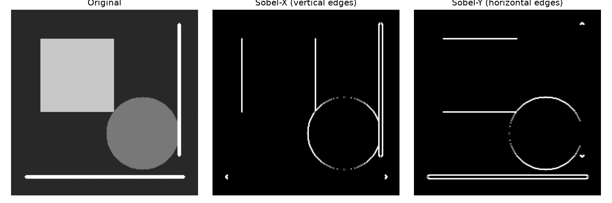

# CS 5720 Neural Networks and Deep Learning
## Home Assignment 2

**Course:** CS 5720 Neural Networks and Deep Learning, Fall 2026
**University:** University of Central Missouri
**Student:** Jeffrey Agnitsch
**Student ID:** 7005146960

---

## How to Install and Run

**Requirements:** Python 3.12, git

```bash
# 1. Clone the repo
git clone https://github.com/jeffragnitsch/cs5720-home-assignment-2.git
cd cs5720-home-assignment-2

# 2. Create and activate a virtual environment
python -m venv .venv
# Windows:
.venv\Scripts\activate

# 3. Install dependencies
pip install -r requirements.txt
```

**Run each question separately** (Q1 and Q2 share the `--epochs` flag, so never run them together):

```bash
python home_assignment_2.py --q 3
python home_assignment_2.py --q 4
python home_assignment_2.py --q 5
python home_assignment_2.py --q 2 --epochs 3
python home_assignment_2.py --q 1 --epochs 10 --rnn_units 512
```

Q1 is CPU-only and takes roughly 6 to 7 minutes on a modern machine. Q4 writes `outputs/q4_sobel.png` as a side effect.

---

## Q1: Character-level LSTM Text Generation

### What the code does

The script trains a character-level LSTM on the Shakespeare corpus, then generates text by sampling one character at a time. The temperature parameter controls how random the sampling is.

### Approach

1. The raw text is tokenized into individual characters and each character is mapped to an integer id.
2. The model is an embedding layer feeding into a single LSTM layer, followed by a dense layer that outputs unnormalized scores (logits) over the vocabulary. There is no softmax in the model itself: the loss applies it during training, and the sampler divides the logits by temperature first and then uses `tf.random.categorical` to draw the next character.
3. After training with `batch_size=64` and `stateful=False`, the weights are saved and reloaded into a stateful model with `batch_size=1` for generation so that the LSTM hidden state carries over between single-character calls.

### Output

**Corpus:** Shakespeare (downloaded via `keras.utils.get_file`), 65 unique characters
**Training time:** 394.3 s on CPU

**Loss per epoch:**

| Epoch | Loss |
|-------|------|
| 1  | 2.4989 |
| 2  | 1.9187 |
| 3  | 1.7226 |
| 4  | 1.6093 |
| 5  | 1.5353 |
| 6  | 1.4811 |
| 7  | 1.4404 |
| 8  | 1.4074 |
| 9  | 1.3813 |
| 10 | 1.3580 |

**Generated samples (seed: "ROMEO: ", 400 characters each):**

```
----- temperature = 0.2 -----
ROMEO: I will not be the prince of the season
That I have send the world to the season.

CORIOLANUS:
What is the best of the season of the season,
That he will be so long and his son, and heart
That thou shalt be a man of the season of the death,
And therefore have meet him to my soul.

First Senator:
The gods of heaven are my lord, I will be so so.

Second Murderer:
What is the season of the good lord.
```

```
----- temperature = 0.5 -----
ROMEO: Cominius of God! The art good heart
To see the consul, which he doth be grace,
And make the beast and sade of your honour.

POMPEY:
I think I have not the broken and so much of
heart that in the prince come to be so langed from his love.

GREMIO:
You have been heaven in the rest need of something.

CLAUDIO:
I do not so, a man of your love lies
That I were the world of himself that home,
But by the
```

```
----- temperature = 1.0 -----
ROMEO: Ood Hastings are I bray for a hand.
Well suppares to a man! Sighors thou would not suspect.

NOMO:
Nay, so stir, Turk?

LUCIO:
And then madam, or in my holy after. I would great
That for my apple
And sink a deneigness thurders shall into ut ass?

TYBALT:
Who lifes well with the peopital? Ore to
shall I ve trenches are better'd sea; he is a maure
mrame to him presently arm on him: how but, now in F
```

```
----- temperature = 1.5 -----
ROMEO: Srepber Wirie:
Ishir, see-What?

Growzor:
Blunties; and, machel Cobior,' unebpry plague;
And, where is nor Young? Iparoth.
This: We never in Prayor??

HERMIO
HENRY VI:
Sucrex, weep, ere
Than the be you, i'
Must trium obBundam.

PETRUCRI:
After Glumio, borio.
Anom:
Here frey astinglamel?'--He comfortshing Sornogs,
defigen-m, to he daimy, ry.

RAMIO:
He
Costhmataes are durbs? fear, furial Phyroith,
```

### Temperature scaling explained

Temperature scaling works by dividing the raw logits by T before the softmax: `p = softmax(z / T)`.

When T is low (0.2), dividing by a small number makes the largest logit much larger relative to the rest, so the softmax output is close to a one-hot vector. The model almost always picks the most likely character, which produces fluent and repetitive text. In my T=0.2 sample you can see "the season" repeated four times in a row: the model keeps looping to its highest-probability continuation.

At T=1.0 the logits are unchanged and the model samples from the distribution it actually learned. The output reads like plausible Shakespeare, but invents words occasionally ("suppares", "maure").

At T=1.5 the logits are divided by a number greater than 1, which compresses them toward each other and flattens the distribution closer to uniform. Every character becomes nearly equally likely, so the output quickly deteriorates into nonsense names and punctuation ("Srepber Wirie", "unebpry plague", strings of question marks).

---

## Q2: IMDB Sentiment Classification with an LSTM

### What the code does

The script loads the Keras IMDB dataset (25,000 train reviews, 25,000 test reviews, top-10,000 words), pads each review to 200 tokens, trains a many-to-one LSTM classifier, then evaluates it and sweeps the decision threshold to show the precision-recall tradeoff.

### Approach

The model is: `Embedding(10000, 128, mask_zero=True)` -> `LSTM(64, dropout=0.2)` -> `Dense(1, sigmoid)`. Using `mask_zero=True` prevents the LSTM from updating its state on padding tokens, which improves the final hidden state. Reviews are pre-padded so the end of the review (where the verdict tends to be) is always at the last time step, and only the final LSTM output feeds the classifier.

**Training results (3 epochs, batch size 128, 20% validation split):**

| Epoch | Train loss | Train acc | Val loss | Val acc |
|-------|-----------|-----------|----------|---------|
| 1 | 0.4521 | 77.83% | 0.3274 | 86.28% |
| 2 | 0.2609 | 89.78% | 0.3473 | 85.20% |
| 3 | 0.2201 | 91.66% | 0.3489 | 84.90% |

### Output

**Confusion matrix** (rows = true label, cols = predicted label; 0 = negative, 1 = positive):

```
[[11377  1123]
 [ 2892  9608]]
TN=11377  FP=1123  FN=2892  TP=9608
```

**Classification report:**

```
              precision    recall  f1-score   support

    negative     0.7973    0.9102    0.8500     12500
    positive     0.8953    0.7686    0.8272     12500

    accuracy                         0.8394     25000
   macro avg     0.8463    0.8394    0.8386     25000
weighted avg     0.8463    0.8394    0.8386     25000
```

**Threshold sweep (positive class):**

| Threshold | Precision | Recall |
|-----------|-----------|--------|
| 0.3 | 0.8315 | 0.8654 |
| 0.4 | 0.8677 | 0.8167 |
| 0.5 | 0.8953 | 0.7686 |
| 0.6 | 0.9167 | 0.7115 |
| 0.7 | 0.9358 | 0.6469 |

### Precision-recall tradeoff interpretation

At the default threshold of 0.5, the model produces 1,123 false positives (negative reviews called positive) and 2,892 false negatives (positive reviews called negative). That asymmetry matters in practice because the two error types have different costs.

Lowering the threshold to 0.3 reduces false negatives to the point where recall reaches 86.5%, meaning the model catches more genuinely positive reviews. The tradeoff is that precision drops to 83.2%, so more negative reviews slip through as false positives. That setting makes sense if missing a positive review is more costly, for example in a recommendation system where failing to surface a good product is worse than occasionally recommending a mediocre one.

Raising the threshold to 0.7 pushes precision to 93.6% at the cost of recall dropping to 64.7%. Only 1 in 3 true positives gets missed at this setting, which makes sense in a spam-filtering or fraud-detection context where false positives are very expensive and you would rather let some bad reviews through than wrongly flag good ones.

The sweep shows there is no free lunch: every gain in precision comes at a direct cost to recall, and the right operating point depends on which error type is more damaging in the application.

---

## Q3: 2-D Convolution with Different Stride and Padding

### What the code does

The script convolves a 5x5 linear ramp input with a 3x3 Laplacian kernel at stride 1 and 2, with VALID and SAME padding. It implements the operation from scratch in NumPy, runs the same operation through `tf.nn.conv2d`, and asserts that both agree.

### Approach

The 5x5 input contains the values 1 through 25 in row-major order (a linear ramp). The 3x3 kernel is the discrete Laplacian:

```
[[ 0,  1,  0],
 [ 1, -4,  1],
 [ 0,  1,  0]]
```

VALID padding means no padding is added; the output size shrinks to `floor((n - k) / s) + 1`. SAME padding adds zeros so the output size is `ceil(n / s)`, with extra rows/columns added at the bottom and right.

### Output

```
Stride = 1, Padding = 'VALID'  ->  output 3x3
[[0. 0. 0.]
 [0. 0. 0.]
 [0. 0. 0.]]

Stride = 1, Padding = 'SAME'  ->  output 5x5
[[  4.   3.   2.   1.  -6.]
 [ -5.   0.   0.   0. -11.]
 [-10.   0.   0.   0. -16.]
 [-15.   0.   0.   0. -21.]
 [-46. -27. -28. -29. -56.]]

Stride = 2, Padding = 'VALID'  ->  output 2x2
[[0. 0.]
 [0. 0.]]

Stride = 2, Padding = 'SAME'  ->  output 3x3
[[  4.   2.  -6.]
 [-10.   0. -16.]
 [-46. -28. -56.]]
```

The VALID outputs are all zeros because the Laplacian kernel computes a discrete second derivative. The input is a linear ramp, which has a constant first derivative and a zero second derivative everywhere in the interior. So every interior position produces exactly zero.

The SAME outputs are nonzero only at the borders because SAME padding surrounds the input with zeros. At those border positions the kernel overlaps the zero-padded region, which breaks the linear ramp and makes the second derivative nonzero. Interior positions still see a perfect linear ramp and still produce zero.

---

## Q4: Sobel Edge Detection and Pooling

### What the code does

The script applies Sobel-X and Sobel-Y kernels to a synthetic grayscale image using OpenCV, cross-checks against `cv2.Sobel`, saves the result, then demonstrates 2x2 max pooling and average pooling with Keras on a random 4x4 matrix.

### Approach

The Sobel-X kernel detects vertical edges (intensity changes in the horizontal direction):

```
[[-1, 0, 1],
 [-2, 0, 2],
 [-1, 0, 1]]
```

The Sobel-Y kernel detects horizontal edges (intensity changes in the vertical direction):

```
[[-1, -2, -1],
 [ 0,  0,  0],
 [ 1,  2,  1]]
```

`cv2.filter2D` with `ddepth=CV_64F` is used so that negative responses (a dark-to-bright transition versus bright-to-dark) are preserved before converting to a displayable `uint8` magnitude image.

The synthetic image has a bright square, a circle, a horizontal line, and a vertical line. Sobel-X produces strong responses on the left and right edges of the square and on the vertical line. Sobel-Y produces strong responses on the top and bottom edges of the square and on the horizontal line.

### Sobel output image



### Pooling

**Original 4x4 matrix:**

```
[[6. 3. 7. 4.]
 [6. 9. 2. 6.]
 [7. 4. 3. 7.]
 [7. 2. 5. 4.]]
```

**2x2 max pooled (stride 2, result is 2x2):**

```
[[9. 7.]
 [7. 7.]]
```

**2x2 average pooled (stride 2, result is 2x2):**

```
[[6.    4.75]
 [5.    4.75]]
```

Max pooling takes the largest value in each 2x2 window, which is why the top-left cell becomes 9 (from the 6/3/6/9 block). Average pooling computes the mean, so the top-left cell is (6+3+6+9)/4 = 6.0.

---

## Q5: Simplified AlexNet and ResNet-like Model

### What the code does

The script builds two CNN architectures using Keras: a simplified version of AlexNet and a small ResNet-like model built from residual blocks. Neither model is trained; the script just builds and prints their summaries.

### Approach

**AlexNet** uses the Sequential API. The first conv layer is 11x11 with stride 4 and VALID padding (227 -> 55, matching the original paper). Every subsequent conv uses SAME padding so spatial size only shrinks at the three MaxPooling layers (55 -> 27 -> 13 -> 6). The three fully-connected layers are Dense(4096), Dense(4096), Dense(10) with dropout between them.

**ResNet-like** uses the Functional API because the skip connections make the graph non-sequential. Each residual block follows the pattern: `Conv2D(ReLU)` -> `Conv2D(no activation)` -> `Add(input)` -> `ReLU`. The skip connection is added to the output of the second conv before the final ReLU, so the block learns a residual F(x) and the output is ReLU(F(x) + x). A 7x7 stem conv with stride 2 brings the input to 64 channels first; two residual blocks follow; then Flatten -> Dense(128) -> Dense(10).

### Output

**AlexNet (simplified):**

```
Model: "AlexNet_simplified"
+--------------------------------------------------------------------------+
| Layer (type)                    | Output Shape           |       Param # |
|---------------------------------+------------------------+---------------|
| conv2d (Conv2D)                 | (None, 55, 55, 96)     |        34,944 |
| max_pooling2d (MaxPooling2D)    | (None, 27, 27, 96)     |             0 |
| conv2d_1 (Conv2D)               | (None, 27, 27, 256)    |       614,656 |
| max_pooling2d_1 (MaxPooling2D)  | (None, 13, 13, 256)    |             0 |
| conv2d_2 (Conv2D)               | (None, 13, 13, 384)    |       885,120 |
| conv2d_3 (Conv2D)               | (None, 13, 13, 384)    |     1,327,488 |
| conv2d_4 (Conv2D)               | (None, 13, 13, 256)    |       884,992 |
| max_pooling2d_2 (MaxPooling2D)  | (None, 6, 6, 256)      |             0 |
| flatten (Flatten)               | (None, 9216)           |             0 |
| dense (Dense)                   | (None, 4096)           |    37,752,832 |
| dropout (Dropout)               | (None, 4096)           |             0 |
| dense_1 (Dense)                 | (None, 4096)           |    16,781,312 |
| dropout_1 (Dropout)             | (None, 4096)           |             0 |
| dense_2 (Dense)                 | (None, 10)             |        40,970 |
+--------------------------------------------------------------------------+
 Total params: 58,322,314 (222.48 MB)
```

**ResNet-like:**

```
Model: "ResNet_like"
 Total params: 102,919,050 (392.61 MB)
```

The ResNet-like model is larger than AlexNet despite being shallower because the Flatten layer outputs 112x112x64 = 802,816 features, and the Dense(128) that follows requires 102.7 M parameters on its own. In practice a GlobalAveragePooling2D layer is used instead to collapse spatial dimensions before the classifier, but for this assignment the architecture matches the assignment specification.

The skip connection is added before the final ReLU in each residual block. That ordering means the gradient can flow directly back through the addition operation without passing through any nonlinearity, which is the key property that lets ResNets train at much greater depth without vanishing gradients.
